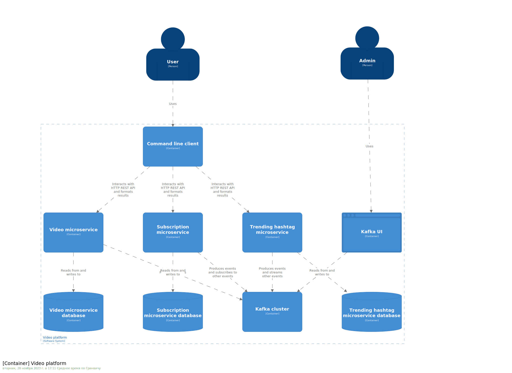

# Video microservices

## This root project contains the following directories:
* video-microservice
  * Stores information about users, videos and hashtags
  * Records users' interactions with videos e.g. likes, views, dislikes, posts
  * Sends messages to their corresponding kafka topics
* trending-hashtag-microservice
  * Subscribes to events from the video microservice and reports the top 10 most liked hashtags within the last hour
* subscriptions-microservice
  * Subscribes to events from the video microservice and:
    * Tracks users' subscriptions to hashtags
    * Provides a list of the top 10 recommended videos for each combination of user and hashtag
    * Sends messages about users subscribing/unsubscribing to the cluster
* client
  * Contains CLI commands that enable interaction with other microservices

---

## C4 container model



---

## Class diagrams
### [Subscription microservice](docs/domain-models/subscription-microservice.md)

### [Video microservice](docs/domain-models/video-microservice.md)

### [Trending hashtags microservice](docs/domain-models/trending-hashtag-microservice.md)

## Running the services locally

### Step 1
Build docker images
```shell
./gradlew dockerBuild
```
### Step 2
Build client jar
```shell
./gradlew client:shadowJar
```
### Step 3
Start the kafka cluster, microservices and databases
```shell
docker compose up
```
### Step 4
Use CLI to interact with the apps. (UNIX/git bash/WSL) 
```shell
./video-services.sh your-command
```

Alternatively, from the `client` directory:
```shell
./gradlew run --args="your commmand"
```
For the full list of commands as well as feature testing instructions, please consult [the client's README](client/README.md)
