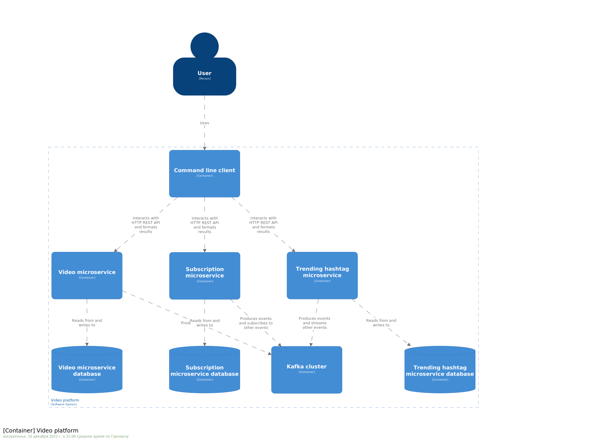

# Video microservices

## This root project contains the following directories:
* microservices
  * Contains the code for the system's components, including:
    * video-microservice
      * Stores information about users, videos and hashtags
      * Records users' interactions with videos e.g. likes, views, dislikes, posts
      * Sends messages to their corresponding kafka topics
    * trending-hashtag-microservice
      * Subscribes to events from the video microservice and reports the top 10 most liked hashtags within the last hour
    * subscriptions-microservice
      * Subscribes to events from the video microservice and:
        * Tracks users' subscriptions to hashtags
        * Provides a list of the top 10 recommended videos for each combination of user and hashtag
        * Sends messages about users subscribing/unsubscribing to the cluster
    * client
      * Contains CLI commands that enable interaction with other microservices
    * generated-shared
      * Contains parts of the generated code that are shared across microservices
* modelling
  * Contains the metamodel, model, validation 
and code generation templates as specified in the assessment brief

---

## C4 container model



---

## Class diagrams
### [Subscription microservice](microservices/docs/domain-models/subscription-microservice.md)

### [Video microservice](microservices/docs/domain-models/video-microservice.md)

### [Trending hashtags microservice](microservices/docs/domain-models/trending-hashtag-microservice.md)

## Running the services locally

### From the top-level directory:

### Step 1
Run the code generator
```shell
./gradlew modelling:codegen
```
### Step 2
Build docker images
```shell
./gradlew dockerBuild
```
### Step 3
Build client jar
```shell
./gradlew microservices:client:shadowJar
```
### Step 4
Start the kafka cluster, microservices and databases
```shell
./compose-prod
```
### Step 5
Use CLI to interact with the apps. (UNIX/git bash/WSL) 
```shell
./video-services your-command
```

Alternatively, from the `microservices/client` directory:
```shell
./gradlew run --args="your commmand"
```
---
## Running tests

### Running all tests at once (~7-8 minute execution time)
```shell
./gradlew test
```
### Running tests for each microservice separately
```shell
./gradlew microservices:<microservice name>:test
```
### Running unit tests for the CLI client
```shell
./gradlew microservices:client:unitTests
```
### Running feature tests of the system
```shell
./gradlew microservices:client:featureTests
```
---
For the full list of commands as well as more information on feature testing, please consult [the client's README](microservices/client/README.md)
