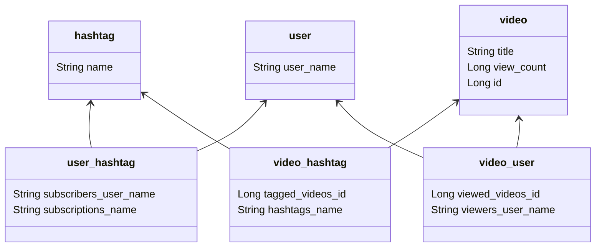

```mermaid
classDiagram
    direction BT
    class hashtag {
        String name
    }
    class user {
        String user_name
    }
    class user_hashtag {
        String subscribers_user_name
        String subscriptions_name
    }
    class video {
        String title
        Long view_count
        Long id
    }
    class video_hashtag {
        Long tagged_videos_id
        String hashtags_name
    }
    class video_user {
        Long viewed_videos_id
        String viewers_user_name
    }
    
    user_hashtag  -->  hashtag
    
    user_hashtag  -->  user
    
    video_hashtag  -->  hashtag
    
    video_hashtag  -->  video
    
    video_user  -->  user
    
    video_user  -->  video
```
[Main README](../../README.md)