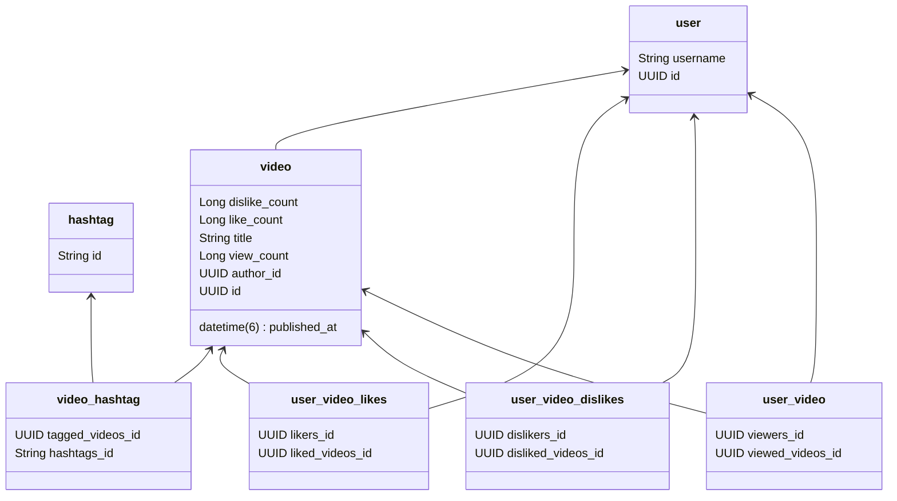

```mermaid
classDiagram
    direction BT
    class hashtag {
        String id
    }
    class user {
        String username
        UUID id
    }
    class user_video {
        UUID viewers_id
        UUID viewed_videos_id
    }
    class user_video_dislikes {
        UUID dislikers_id
        UUID disliked_videos_id
    }
    class user_video_likes {
        UUID likers_id
        UUID liked_videos_id
    }
    class video {
        Long dislike_count
        Long like_count
        datetime(6) published_at
        String title
        Long view_count
        UUID author_id
        UUID id
    }
    class video_hashtag {
        UUID tagged_videos_id
        String hashtags_id
    }

    user_video  -->  user
    user_video  -->  video
    user_video_dislikes  -->  user
    user_video_dislikes  -->  video
    user_video_likes  -->  user
    user_video_likes  -->  video
    video  -->  user
    video_hashtag  -->  hashtag
    video_hashtag  -->  video
```
[Main README](../../../README.md)