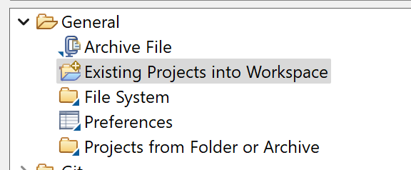
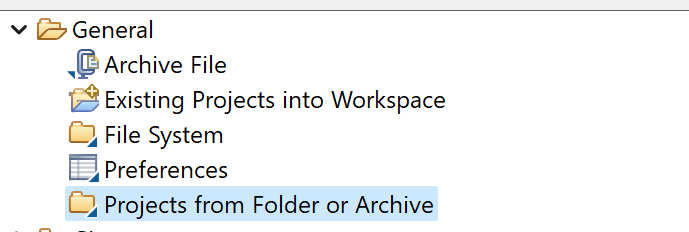

# Package structure

* metamodel
  * ecore and emf metamodel files
  * evl file for validating models
  * genmodel file for generating the editor
  * aird file for viewing the metamodel class diagram
* models
  * aird file for viewing/editing the graphical representation of the model
  * YY3892609 file containing a model of the system
* models.design
  * viewpoint specification project to be imported alongside the models folder

---
# Starting the graphical editor
* From the `metamodel` folder:
  * run the metamodel.edit or metamodel.editor project as an eclipse application
* In the nested eclipse application:
  * import the `models` folder as a project:   
  * import the `models.design` project: 

---
# Navigating the model representations

## 5 representations are provided
* A top level overview of the system containing:
  * Kafka producers and consumers (and streams)
  * Entities, their field names and types for each microservice
  * Available CLI commands
* An overview of the system from a messaging perspective, containing:
  * Kafka topics
  * Types of kafka message keys
  * Message value DTO's and the relationships between DTO's and microservices
* An overview of the CLI client, containing:
  * Command names
  * Command arguments and their types
  * For command arguments that reference an enum, enums are displayed and linked to argument nodes
* For each microservice, a diagram of its API, containing:
  * The names of controllers/clients
  * The names of endpoints, their URL and query params
  * For non-string return values, links to response DTO's are shown
* For each microservice, a diagram of its domain, containing:
  * The names of entities
  * Entities, their field names and types
  * Entity relationships, with labels for connecting fields and differentiation between relationship types

## Navigation between views is possible by double clicking the links in each diagram or double clicking a corresponding node (e.g. clicking an API schema node to navigate to its representation or clicking any entity node to navigate to its service's domain diagram)